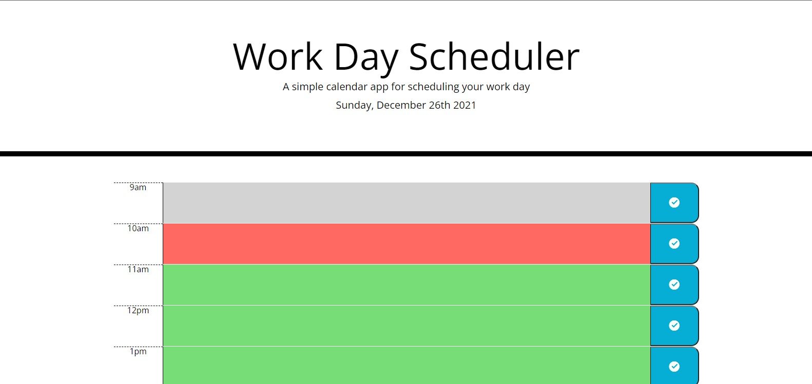

# Hourly-organizer

## Purpose

A daily planner highlighting past hours, current hour, and future hour throughout the day. Allowing you to save a note or task per each time block.

## Challenges

A few main challenges I ran into were getting used to bootstrap and jquery to construct the page and functions. Also getting the user input to save in local storage proved difficult. With help from TA's, my tutor, and reources like W3 and MDN. I was able to get my Hourly-organizer like you see it now.

## Built With

* HTML
* CSS
* Javascript

## Website

<https://dsapione.github.io/Hourly-organizer/>
